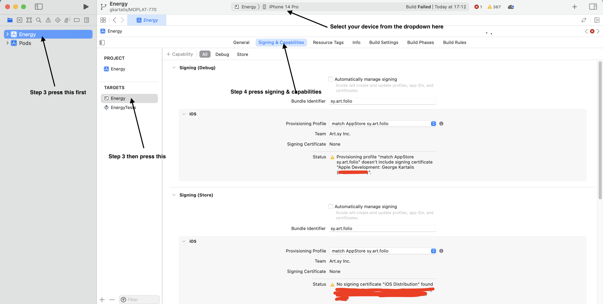

# Getting Started

### Prerequisites

You'll need [Node](https://nodejs.org/en/), [Yarn](https://yarnpkg.com/en/) and Watchman installed (`brew install watchman`).

> The Node version should match [the `engine` version here](https://github.com/artsy/eigen/blob/main/package.json).

You'll also need to have aws set up.

### Set up iOS

Download Xcode version 13. You can find all available versions of Xcode at [Apple's Developer Portal 🔐](http://developer.apple.com/download/more/).

Ask your mentor to add you on the [firebase.console](https://console.firebase.google.com/project/eigen-a7d3b/settings/iam) to be able to release.

<details><summary>NOTE: After installing Xcode</summary>

Check that Command Line Tools version is added in the Locations tab. Xcode>Preferences>Locations:


</details>

### Set up Android

1. Android development environment: Follow the [official docs](https://reactnative.dev/docs/environment-setup). Select "React Native CLI Quickstart" tab

1. [Create a virtual device](https://developer.android.com/studio/run/managing-avds) on which to run the Android app.

### Get energy

```
git clone https://github.com/artsy/energy.git
cd energy
```

### Install the dependencies

1. Install dependencies

```bash
yarn setup:artsy
yarn install:all
```

2. Run the app

```sh
// Start the react-native bundler
yarn start

// Run the iOS app
yarn ios

// Run the Android app
// (first make sure you already have an emulator set up)

yarn android

```

<details><summary>Independent Contributor?</summary>
WIP
</details>

### Running on a real iOS device

1. Install dependencies

```sh
yarn setup:artsy
yarn install:all
```

2. Open xcode

```sh
yarn open-xcode
```

3. On the left side of `XCode` select Energy and then select the Energy target. On the right side select your device from the dropdown menu. (check screenshot below)

4. Select Signing & Capabilities and check Automatically manage signing and select your team `Art.sy Inc.` from the dropdown menu. (check screenshot below)



5. Run the app pressing the play button

> :warning: This will generate a diff on `project.pbxproj` file that you should **not** commit with your changes.

## Contribute

We welcome independent contributions! Feel free to open an issue and open a PR and assign one of [Brian Beckerle](https://github.com/brainbicycle) [Pavlos Vinieratos](https://github.com/pvinis) [Mounir Dhahri](https://github.com/MounirDhahri) as a reviewer or anyone else listed [here](https://github.com/artsy/energy#meta).

## Account

If you need an account, make a non-artsymail account, and contact mobile-platform team.
Alternatively, use the shared account. Search for `Shared Partner (folio)` on 1Password.

## Read more

Check out our [blog.](http://artsy.github.io/blog/categories/energy/) for more in-depth discussions on Folio.
